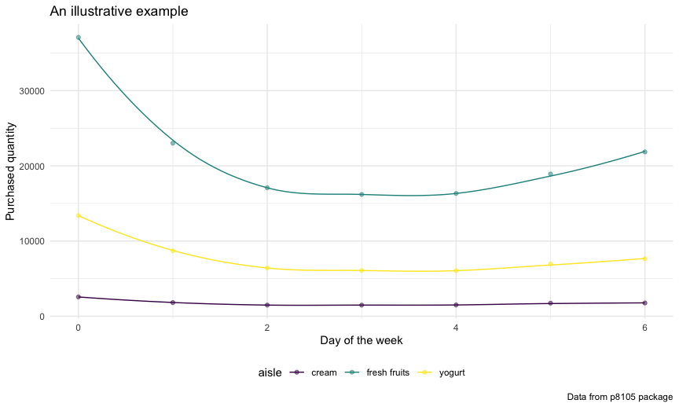
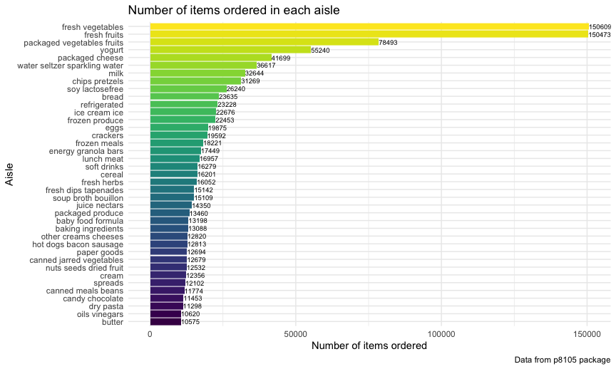

p8105\_hw3\_qw2331
================

## Problem 1

**Load the `instacart` data**

``` r
data("instacart")
instacart_df <- instacart
```

**A brief description about `instacart`**

``` r
# Quickly overview
summary(instacart_df)
```

    ##     order_id         product_id    add_to_cart_order   reordered     
    ##  Min.   :      1   Min.   :    1   Min.   : 1.000    Min.   :0.0000  
    ##  1st Qu.: 843370   1st Qu.:13380   1st Qu.: 3.000    1st Qu.:0.0000  
    ##  Median :1701880   Median :25298   Median : 7.000    Median :1.0000  
    ##  Mean   :1706298   Mean   :25556   Mean   : 8.758    Mean   :0.5986  
    ##  3rd Qu.:2568023   3rd Qu.:37940   3rd Qu.:12.000    3rd Qu.:1.0000  
    ##  Max.   :3421070   Max.   :49688   Max.   :80.000    Max.   :1.0000  
    ##     user_id         eval_set          order_number      order_dow    
    ##  Min.   :     1   Length:1384617     Min.   :  4.00   Min.   :0.000  
    ##  1st Qu.: 51732   Class :character   1st Qu.:  6.00   1st Qu.:1.000  
    ##  Median :102933   Mode  :character   Median : 11.00   Median :3.000  
    ##  Mean   :103113                      Mean   : 17.09   Mean   :2.701  
    ##  3rd Qu.:154959                      3rd Qu.: 21.00   3rd Qu.:5.000  
    ##  Max.   :206209                      Max.   :100.00   Max.   :6.000  
    ##  order_hour_of_day days_since_prior_order product_name          aisle_id    
    ##  Min.   : 0.00     Min.   : 0.00          Length:1384617     Min.   :  1.0  
    ##  1st Qu.:10.00     1st Qu.: 7.00          Class :character   1st Qu.: 31.0  
    ##  Median :14.00     Median :15.00          Mode  :character   Median : 83.0  
    ##  Mean   :13.58     Mean   :17.07                             Mean   : 71.3  
    ##  3rd Qu.:17.00     3rd Qu.:30.00                             3rd Qu.:107.0  
    ##  Max.   :23.00     Max.   :30.00                             Max.   :134.0  
    ##  department_id      aisle            department       
    ##  Min.   : 1.00   Length:1384617     Length:1384617    
    ##  1st Qu.: 4.00   Class :character   Class :character  
    ##  Median : 8.00   Mode  :character   Mode  :character  
    ##  Mean   : 9.84                                        
    ##  3rd Qu.:16.00                                        
    ##  Max.   :21.00

-   This dataset contains `1384617` observations and `15` variables.  
-   Among the variables, there are `11` integer variables and `4`
    character variables.  
-   Among all the variables, which are
    `order_id, product_id, add_to_cart_order, reordered, user_id, eval_set, order_number, order_dow, order_hour_of_day, days_since_prior_order, product_name, aisle_id, department_id, aisle, department`,
    respectively, the key variables are:
    -   `order_id` represents an order identifier;  
    -   `product_id` represents a product identifier;  
    -   `user_id` represents a customer identifier;  
    -   `aisle_id` represents an aisle identifier;  
    -   `department_id` represents a department identifier.  
-   Illustrative examples of observations are showing below:

``` r
# Illustrative examples
items_day_p <- 
  instacart_df %>% 
  filter(aisle %in% c("yogurt", "cream", "fresh fruits")) %>% 
  group_by(aisle, order_dow) %>% 
  summarize(n_purchase = n()) %>% 
  ggplot(aes(x = order_dow, y = n_purchase, color = aisle)) + 
  geom_point(alpha = .5) + 
  geom_smooth(se = FALSE, size = .5) + 
  labs(
    x = "Day of the week",
    y = "Purchased quantity",
    caption = "Data from p8105 package"
  )

items_day_p
```



-   The plot shows that:
    -   `Fresh furits` have the highest sales volume comparing with the
        other two;  
    -   In generally, people will shop online using Instacart on Sunday.

**Answer the following questions**  
+ How many aisles are there, and which aisles are the most items ordered
from?

``` r
n_items_of_aisle <- 
  instacart_df %>% 
  count(aisle, name = "n_items") %>% 
  arrange(desc(n_items))

n_items_of_aisle
```

    ## # A tibble: 134 × 2
    ##    aisle                         n_items
    ##    <chr>                           <int>
    ##  1 fresh vegetables               150609
    ##  2 fresh fruits                   150473
    ##  3 packaged vegetables fruits      78493
    ##  4 yogurt                          55240
    ##  5 packaged cheese                 41699
    ##  6 water seltzer sparkling water   36617
    ##  7 milk                            32644
    ##  8 chips pretzels                  31269
    ##  9 soy lactosefree                 26240
    ## 10 bread                           23635
    ## # … with 124 more rows

There are `134` aisles in this dataset; Most items are ordered from the
aisle `fresh vegetables`.

-   Make a plot that shows the number of items ordered in each aisle,
    limiting this to aisle with more than 10000 items ordered. Arrange
    aisles sensibly, and organize your plot so others can read it.

``` r
n_items_of_aisle %>% 
  filter(n_items > 10000) %>% 
  mutate(
    aisle = fct_reorder(aisle, n_items)
  ) %>% 
  ggplot(aes(x = n_items, y = aisle, fill = aisle)) +
  geom_bar(
    stat = "identity", 
    show_guide = FALSE
    ) + 
  geom_text(aes(label = n_items), size = 2.5, hjust = 0) + 
  labs(
    x = "Number of items",
    y = "Aisle",
    title = "Number of items ordered in each aisle",
    caption = "Data from p8105 package"
  )
```



-   Make a table showing the three most popular items in each of the
    aisles “baking ingredients”, “dog food care”, and “packaged
    vegetables fruits”. Include the number of times each item is ordered
    in your table.

``` r
instacart_df %>% 
  filter(
    aisle %in% 
      c("baking ingredients", "dog food care", "packaged vegetables fruits")
  ) %>% 
  group_by(aisle, product_name) %>%
  summarize(number_items = n()) %>% 
  arrange(desc(number_items)) %>% 
  do(head(., n = 3)) %>% 
  knitr::kable()
```

| aisle                      | product\_name                                 | number\_items |
|:---------------------------|:----------------------------------------------|--------------:|
| baking ingredients         | Light Brown Sugar                             |           499 |
| baking ingredients         | Pure Baking Soda                              |           387 |
| baking ingredients         | Cane Sugar                                    |           336 |
| dog food care              | Snack Sticks Chicken & Rice Recipe Dog Treats |            30 |
| dog food care              | Organix Chicken & Brown Rice Recipe           |            28 |
| dog food care              | Small Dog Biscuits                            |            26 |
| packaged vegetables fruits | Organic Baby Spinach                          |          9784 |
| packaged vegetables fruits | Organic Raspberries                           |          5546 |
| packaged vegetables fruits | Organic Blueberries                           |          4966 |

-   Make a table showing the mean hour of the day at which Pink Lady
    Apples and Coffee Ice Cream are ordered on each day of the week;
    format this table for human readers (i.e. produce a 2 \* 7 table)

``` r
instacart_df %>% 
  filter(
    product_name %in%
      c("Pink Lady Apples", "Coffee Ice Cream")
  ) %>% 
  group_by(product_name, order_dow) %>% 
  summarize(
    mean_hour = mean(order_hour_of_day)
  ) %>% 
  mutate(
    order_dow = weekdays(Sys.Date()+0:6)[order_dow + 1]
  ) %>% 
  pivot_wider(
    names_from = order_dow,
    values_from = mean_hour
  ) %>% 
  knitr::kable(digits = 1)
```

| product\_name    | Sunday | Monday | Tuesday | Wednesday | Thursday | Friday | Saturday |
|:-----------------|-------:|-------:|--------:|----------:|---------:|-------:|---------:|
| Coffee Ice Cream |   13.8 |   14.3 |    15.4 |      15.3 |     15.2 |   12.3 |     13.8 |
| Pink Lady Apples |   13.4 |   11.4 |    11.7 |      14.2 |     11.6 |   12.8 |     11.9 |
