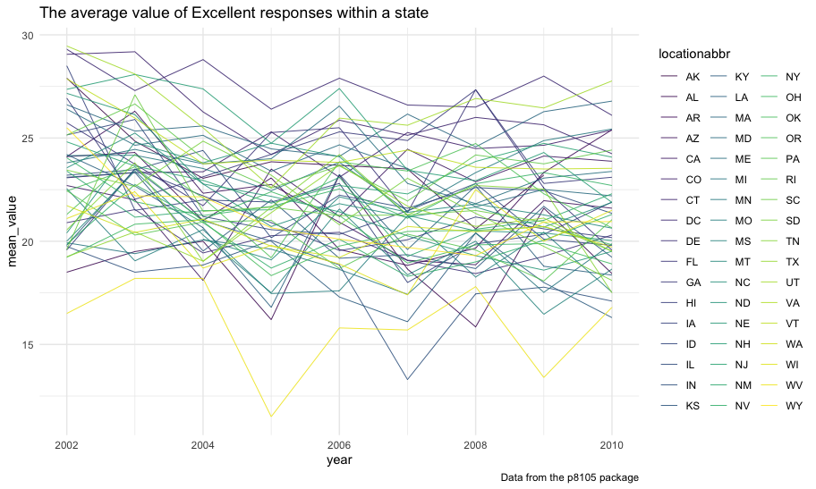
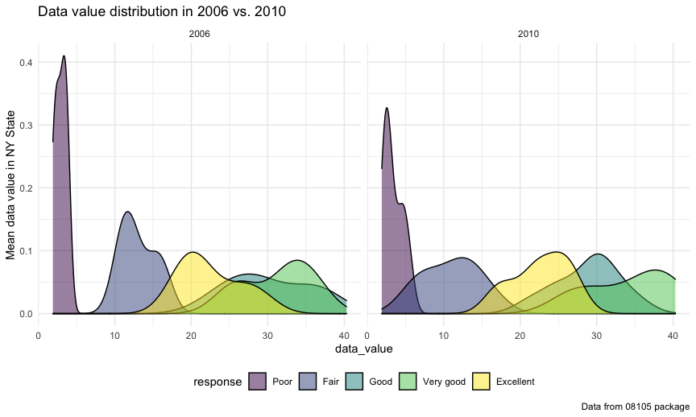

p8105\_hw3\_qw2331
================

## Problem 1

**Load the `instacart` data**

``` r
data("instacart")
inst_df <- instacart
```

**A brief description about `instacart`**

``` r
# Quickly overview
summary(inst_df)
```

    ##     order_id         product_id    add_to_cart_order   reordered     
    ##  Min.   :      1   Min.   :    1   Min.   : 1.000    Min.   :0.0000  
    ##  1st Qu.: 843370   1st Qu.:13380   1st Qu.: 3.000    1st Qu.:0.0000  
    ##  Median :1701880   Median :25298   Median : 7.000    Median :1.0000  
    ##  Mean   :1706298   Mean   :25556   Mean   : 8.758    Mean   :0.5986  
    ##  3rd Qu.:2568023   3rd Qu.:37940   3rd Qu.:12.000    3rd Qu.:1.0000  
    ##  Max.   :3421070   Max.   :49688   Max.   :80.000    Max.   :1.0000  
    ##     user_id         eval_set          order_number      order_dow    
    ##  Min.   :     1   Length:1384617     Min.   :  4.00   Min.   :0.000  
    ##  1st Qu.: 51732   Class :character   1st Qu.:  6.00   1st Qu.:1.000  
    ##  Median :102933   Mode  :character   Median : 11.00   Median :3.000  
    ##  Mean   :103113                      Mean   : 17.09   Mean   :2.701  
    ##  3rd Qu.:154959                      3rd Qu.: 21.00   3rd Qu.:5.000  
    ##  Max.   :206209                      Max.   :100.00   Max.   :6.000  
    ##  order_hour_of_day days_since_prior_order product_name          aisle_id    
    ##  Min.   : 0.00     Min.   : 0.00          Length:1384617     Min.   :  1.0  
    ##  1st Qu.:10.00     1st Qu.: 7.00          Class :character   1st Qu.: 31.0  
    ##  Median :14.00     Median :15.00          Mode  :character   Median : 83.0  
    ##  Mean   :13.58     Mean   :17.07                             Mean   : 71.3  
    ##  3rd Qu.:17.00     3rd Qu.:30.00                             3rd Qu.:107.0  
    ##  Max.   :23.00     Max.   :30.00                             Max.   :134.0  
    ##  department_id      aisle            department       
    ##  Min.   : 1.00   Length:1384617     Length:1384617    
    ##  1st Qu.: 4.00   Class :character   Class :character  
    ##  Median : 8.00   Mode  :character   Mode  :character  
    ##  Mean   : 9.84                                        
    ##  3rd Qu.:16.00                                        
    ##  Max.   :21.00

``` r
str(inst_df)
```

    ## tibble [1,384,617 × 15] (S3: tbl_df/tbl/data.frame)
    ##  $ order_id              : int [1:1384617] 1 1 1 1 1 1 1 1 36 36 ...
    ##  $ product_id            : int [1:1384617] 49302 11109 10246 49683 43633 13176 47209 22035 39612 19660 ...
    ##  $ add_to_cart_order     : int [1:1384617] 1 2 3 4 5 6 7 8 1 2 ...
    ##  $ reordered             : int [1:1384617] 1 1 0 0 1 0 0 1 0 1 ...
    ##  $ user_id               : int [1:1384617] 112108 112108 112108 112108 112108 112108 112108 112108 79431 79431 ...
    ##  $ eval_set              : chr [1:1384617] "train" "train" "train" "train" ...
    ##  $ order_number          : int [1:1384617] 4 4 4 4 4 4 4 4 23 23 ...
    ##  $ order_dow             : int [1:1384617] 4 4 4 4 4 4 4 4 6 6 ...
    ##  $ order_hour_of_day     : int [1:1384617] 10 10 10 10 10 10 10 10 18 18 ...
    ##  $ days_since_prior_order: int [1:1384617] 9 9 9 9 9 9 9 9 30 30 ...
    ##  $ product_name          : chr [1:1384617] "Bulgarian Yogurt" "Organic 4% Milk Fat Whole Milk Cottage Cheese" "Organic Celery Hearts" "Cucumber Kirby" ...
    ##  $ aisle_id              : int [1:1384617] 120 108 83 83 95 24 24 21 2 115 ...
    ##  $ department_id         : int [1:1384617] 16 16 4 4 15 4 4 16 16 7 ...
    ##  $ aisle                 : chr [1:1384617] "yogurt" "other creams cheeses" "fresh vegetables" "fresh vegetables" ...
    ##  $ department            : chr [1:1384617] "dairy eggs" "dairy eggs" "produce" "produce" ...
    ##  - attr(*, "spec")=
    ##   .. cols(
    ##   ..   order_id = col_integer(),
    ##   ..   product_id = col_integer(),
    ##   ..   add_to_cart_order = col_integer(),
    ##   ..   reordered = col_integer(),
    ##   ..   user_id = col_integer(),
    ##   ..   eval_set = col_character(),
    ##   ..   order_number = col_integer(),
    ##   ..   order_dow = col_integer(),
    ##   ..   order_hour_of_day = col_integer(),
    ##   ..   days_since_prior_order = col_integer(),
    ##   ..   product_name = col_character(),
    ##   ..   aisle_id = col_integer(),
    ##   ..   department_id = col_integer(),
    ##   ..   aisle = col_character(),
    ##   ..   department = col_character()
    ##   .. )

-   This dataset contains `1384617` observations and `15` variables.  
-   Among all the variables, there are `11` integer variables and `4`
    character variables.  
-   Of all the variables, which are
    `order_id, product_id, add_to_cart_order, reordered, user_id, eval_set, order_number, order_dow, order_hour_of_day, days_since_prior_order, product_name, aisle_id, department_id, aisle, department`,
    respectively, the key variables are:
    -   `order_id` represents an order identifier;  
    -   `product_id` represents a product identifier;  
    -   `user_id` represents a customer identifier;  
    -   `aisle_id` represents an aisle identifier;  
    -   `department_id` represents a department identifier.  
-   Illustrative examples of observations are showing below:

``` r
# An illustrative example
items_day_p <- 
  inst_df %>% 
  filter(aisle %in% c("yogurt", "cream", "fresh fruits")) %>% 
  group_by(aisle, order_dow) %>% 
  summarize(n_purchase = n()) %>% 
  ggplot(aes(x = order_dow, y = n_purchase, color = aisle)) + 
  geom_point(alpha = .5) + 
  geom_smooth(se = FALSE, size = .5) + 
  labs(
    x = "Day of the week",
    y = "Purchased quantity",
    title = "An illustrative example",
    caption = "Data from p8105 package"
  )

items_day_p
```


``` r
# A brief description of the first row data
inst_df %>% 
  head(1) %>% 
  knitr::kable()
```

| order\_id | product\_id | add\_to\_cart\_order | reordered | user\_id | eval\_set | order\_number | order\_dow | order\_hour\_of\_day | days\_since\_prior\_order | product\_name    | aisle\_id | department\_id | aisle  | department |
|----------:|------------:|---------------------:|----------:|---------:|:----------|--------------:|-----------:|---------------------:|--------------------------:|:-----------------|----------:|---------------:|:-------|:-----------|
|         1 |       49302 |                    1 |         1 |   112108 | train     |             4 |          4 |                   10 |                         9 | Bulgarian Yogurt |       120 |             16 | yogurt | dairy eggs |

-   The plot shows that:
    -   `Fresh furits` had the highest sales volume compared with the
        other two;  
    -   In generally, people will shop online using Instacart more
        frequently on Sunday.
-   The table shows that:
    -   At 10 in the morning on Thursday, a customer with `user_id`
        112108 bought a `Bulgarian Yogurt`, which `product_id` is 49302;
    -   This product belongs to the `dairy eggs` department with
        `department_id` 16 and `yogurt` aisle with `aisle_id` 120;
    -   This customer had bought this product before and for this time
        he/she added this same product into the shopping cart in the
        first place order (`add_to_cart_order` = 1);
    -   It was the fourth time (`order_number` = 4) this customer
        shopping online using Instacart and it had been nine days since
        his/her last shopping trip (`days_since_prior_order` = 9).

**Answer the following questions**  
+ How many aisles are there, and which aisles are the most items ordered
from?

``` r
n_items_of_aisle <- 
  inst_df %>% 
  count(aisle, name = "n_items") %>% 
  arrange(desc(n_items))

n_items_of_aisle
```

    ## # A tibble: 134 × 2
    ##    aisle                         n_items
    ##    <chr>                           <int>
    ##  1 fresh vegetables               150609
    ##  2 fresh fruits                   150473
    ##  3 packaged vegetables fruits      78493
    ##  4 yogurt                          55240
    ##  5 packaged cheese                 41699
    ##  6 water seltzer sparkling water   36617
    ##  7 milk                            32644
    ##  8 chips pretzels                  31269
    ##  9 soy lactosefree                 26240
    ## 10 bread                           23635
    ## # … with 124 more rows

There are `134` aisles in this dataset; Most items are ordered from the
aisle `fresh vegetables`.

-   Make a plot that shows the number of items ordered in each aisle,
    limiting this to aisle with more than 10000 items ordered. Arrange
    aisles sensibly, and organize your plot so others can read it.

``` r
n_items_of_aisle %>% 
  filter(n_items > 10000) %>% 
  mutate(
    aisle = fct_reorder(aisle, n_items)
  ) %>% 
  ggplot(aes(x = n_items, y = aisle, fill = aisle)) +
  geom_bar(
    stat = "identity",
    show_guide = FALSE
    ) + 
  geom_text(aes(label = n_items), size = 2.5, hjust = 0) + 
  labs(
    x = "Number of items ordered",
    y = "Aisle",
    title = "Number of items ordered in each aisle",
    caption = "Data from p8105 package"
  )
```


-   Make a table showing the three most popular items in each of the
    aisles “baking ingredients”, “dog food care”, and “packaged
    vegetables fruits”. Include the number of times each item is ordered
    in your table.

``` r
inst_df %>% 
  filter(
    aisle %in% 
      c("baking ingredients", "dog food care", "packaged vegetables fruits")
  ) %>% 
  group_by(aisle, product_name) %>%
  summarize(number_items = n()) %>% 
  arrange(desc(number_items)) %>% 
  do(head(., n = 3)) %>% 
  knitr::kable(
    caption = "Top 3 most popular items",
    align = "c"
  )
```

|           aisle            |                 product\_name                 | number\_items |
|:--------------------------:|:---------------------------------------------:|:-------------:|
|     baking ingredients     |               Light Brown Sugar               |      499      |
|     baking ingredients     |               Pure Baking Soda                |      387      |
|     baking ingredients     |                  Cane Sugar                   |      336      |
|       dog food care        | Snack Sticks Chicken & Rice Recipe Dog Treats |      30       |
|       dog food care        |      Organix Chicken & Brown Rice Recipe      |      28       |
|       dog food care        |              Small Dog Biscuits               |      26       |
| packaged vegetables fruits |             Organic Baby Spinach              |     9784      |
| packaged vegetables fruits |              Organic Raspberries              |     5546      |
| packaged vegetables fruits |              Organic Blueberries              |     4966      |

Top 3 most popular items

-   Make a table showing the mean hour of the day at which Pink Lady
    Apples and Coffee Ice Cream are ordered on each day of the week;
    format this table for human readers (i.e. produce a 2 \* 7 table)

``` r
inst_df %>% 
  filter(
    product_name %in%
      c("Pink Lady Apples", "Coffee Ice Cream")
  ) %>% 
  group_by(product_name, order_dow) %>% 
  summarize(
    mean_hour = mean(order_hour_of_day)
  ) %>% 
  mutate(
    order_dow = weekdays(as.Date("2021-10-17") + 0:6)[order_dow + 1]
  ) %>% 
  pivot_wider(
    names_from = order_dow,
    values_from = mean_hour
  ) %>% 
  knitr::kable(
    digits = 1,
    caption = "Mean hour of a day ordered",
    align = "c")
```

|  product\_name   | Sunday | Monday | Tuesday | Wednesday | Thursday | Friday | Saturday |
|:----------------:|:------:|:------:|:-------:|:---------:|:--------:|:------:|:--------:|
| Coffee Ice Cream |  13.8  |  14.3  |  15.4   |   15.3    |   15.2   |  12.3  |   13.8   |
| Pink Lady Apples |  13.4  |  11.4  |  11.7   |   14.2    |   11.6   |  12.8  |   11.9   |

Mean hour of a day ordered

## Problem 2

**Load the `BRFSS` data**

``` r
data("brfss_smart2010")
brfss_df <- brfss_smart2010
```

**Do some data cleaning**

``` r
brfss_df <- 
  brfss_df %>% 
  janitor::clean_names() %>% 
  filter(topic == "Overall Health") %>% 
  mutate(
    response = factor(response,
                      levels = c("Poor", "Fair", "Good", "Very good", "Excellent"),
                      ordered = TRUE)
  )
```

**Answer the following questions**  
+ In 2002, which states were observed at 7 or more locations? What about
2010?

``` r
# Number of locations in 2002
loc_2002 <- 
  brfss_df %>% 
  filter(year == 2002) %>% 
  group_by(locationabbr) %>% 
  summarize(n_locations = n()/5) %>% 
  filter(n_locations >= 7) %>% 
  arrange(n_locations)

loc_2002 %>%   
  knitr::kable(
    caption = "Number of locations in 2002",
    align = "l"
  )
```

| locationabbr | n\_locations |
|:-------------|:-------------|
| CT           | 7            |
| FL           | 7            |
| NC           | 7            |
| MA           | 8            |
| NJ           | 8            |
| PA           | 10           |

Number of locations in 2002

``` r
# Number of locations in 2010
loc_2010 <- 
  brfss_df %>% 
  filter(year == 2010) %>% 
  group_by(locationabbr) %>% 
  summarize(n_locations = n()/5) %>% 
  filter(n_locations >= 7) %>% 
  arrange(n_locations)

loc_2010 %>% 
  knitr::kable(
    caption = "Number of locations in 2010",
    align = "l"
  )
```

| locationabbr | n\_locations |
|:-------------|:-------------|
| CO           | 7            |
| PA           | 7            |
| SC           | 7            |
| OH           | 8            |
| MA           | 9            |
| NY           | 9            |
| NE           | 10           |
| WA           | 10           |
| CA           | 12           |
| MD           | 12           |
| NC           | 12           |
| TX           | 16           |
| NJ           | 19           |
| FL           | 41           |

Number of locations in 2010

In 2002, there are `6` states in which 7 or more locations were
observed, including `CT, FL, NC, MA, NJ, PA`, while in 2010, `14` states
met the above conditions and they were
`CO, PA, SC, OH, MA, NY, NE, WA, CA, MD, NC, TX, NJ, FL`, respectively.

-   Construct a dataset that is limited to `Excellent` responses, and
    contains, year, state, and a variable that averages the `data_value`
    across locations within a state. Make a “spaghetti” plot of this
    average value over time within a state.

``` r
# Construct a dataset
response_in_state <-   
  brfss_df %>% 
  filter(response == "Excellent") %>% 
  group_by(year, locationabbr) %>% 
  summarize(
    mean_value = mean(data_value, na.rm = TRUE)
  )

# A "spaghetti" plot
response_in_state %>% 
  ggplot(aes(x = year, y = mean_value, color = locationabbr)) + 
  geom_line(size = .3) + 
  theme(
    legend.position = "right"
  ) + 
  labs(
    title = "The average value of Excellent responses within a state",
    caption = "Data from the p8105 package"
  )
```



-   Make a two-panel plot showing, for the years 2006, and 2010,
    distribution of `data_value` for responses(“Poor” to “Excellent”)
    among locations in NY state.

``` r
brfss_df %>% 
  filter(
    year %in% c(2006, 2010) & locationabbr == "NY") %>% 
  ggplot(aes(x = data_value, fill = response)) + 
  geom_density(alpha = .5) +  
  facet_grid(. ~ year) + 
  labs(
    y = "Mean data value in NY State",
    title = "Data value distribution in 2006 vs. 2010",
    caption = "Data from 08105 package"
  )
```



## Problem 3

**Load the data `accel_data`**

``` r
# Load the data
accel_raw <- 
  read_csv("./data/accel_data.csv")
```

**Answer the following question**  
+ Tidy and wrangle the data

``` r
accel_df <- 
  accel_raw %>% 
  janitor::clean_names() %>% 
  pivot_longer(
    activity_1:activity_1440,
    names_prefix = "activity_",
    names_to = "minute",
    values_to = "activity"
  ) %>% 
  mutate(
    minute = as.numeric(minute),
    dow = ifelse(day %in% weekdays(as.Date("2021-10-16") + 0:1), "weekend", "weekday")
  ) %>% 
  relocate(week, day_id, day, dow)
```

-   A short description:
    -   The existing variables are
        `week, day_id, day, dow, minute, activity` and there are `50400`
        observations;
    -   Variable `week` represents the week number ranging from `1` to
        `7`;
    -   Variable `day_id` represents a day identifier, ranging from `1`
        to `35`;
    -   Variable `day` and `dow` represents the day of a week and
        whether it is a weekday or weekend;
    -   Variable `minute` represents each minute within a 24-hour day,
        which ranges from `1` to `1440`;
    -   Variable `activity` represents the activity value collected with
        min value `1` and max value `8982`.
-   Focus on the total activity

``` r
# Aggregate minutes data
ttl_act <- 
  accel_df %>% 
  group_by(week, day) %>% 
  summarize(
    sum_activity = sum(activity)
  )

# Create a table
ttl_act %>% 
  pivot_wider(
    names_from = "day",
    values_from = "sum_activity"
  ) %>% 
  relocate(1, 5, 3, 7, 8, 6, 2, 4) %>% 
  knitr::kable(
    caption = "Total activity thru a day",
    align = "l"
  )
```

| week | Sunday | Monday    | Tuesday  | Wednesday | Thursday | Friday   | Saturday |
|:-----|:-------|:----------|:---------|:----------|:---------|:---------|:---------|
| 1    | 631105 | 78828.07  | 307094.2 | 340115    | 355923.6 | 480542.6 | 376254   |
| 2    | 422018 | 295431.00 | 423245.0 | 440962    | 474048.0 | 568839.0 | 607175   |
| 3    | 467052 | 685910.00 | 381507.0 | 468869    | 371230.0 | 467420.0 | 382928   |
| 4    | 260617 | 409450.00 | 319568.0 | 434460    | 340291.0 | 154049.0 | 1440     |
| 5    | 138421 | 389080.00 | 367824.0 | 445366    | 549658.0 | 620860.0 | 1440     |

Total activity thru a day

``` r
# Draw a plot
ttl_act %>% 
  mutate(
    day = factor(day, levels = weekdays(as.Date("2021-10-18") + 0:6))
  ) %>% 
  ggplot(aes(x = day, y = sum_activity, group = week, color = week)) + 
  geom_point(alpha = .8) + 
  geom_line()
```


From the above plot, in general, the total activity on weekends is less
than weekdays.

-   Show the 24-hour activity time courses for each day

``` r
accel_df %>% 
  ggplot(aes(x = minute / 60, y = activity, color = day)) + 
  geom_line() + 
  labs(
    x = "Hours",
    y = "Activity",
    title = "24-hour activity time courses"
  )
```


-   From the above plot,
    -   The activity counts are obviously lower from midnight to early
        morning;
    -   This participant is more active near noon and the late night
        around 8 pm to 10 pm.
